# 英卡助手 · LinguaCard V1说明

## 📌 项目简介

**LinguaCard** 是一个基于大语言模型和文生图模型的英语学习卡片生成器，支持自动生成英文段落、重点词汇、中文翻译及配套插图，并以卡片样式导出为 HTML 和 PNG 图片，可用于小红书、抖音等平台发布

本版本为 V1，实现了从输入主题词 → 自动内容生成 → 插图生成 → HTML 渲染 → 卡片导出 的完整流程。

<h3>卡片展示示例</h3>

<table>
  <tr>
    <td></td>
    <td></td>
  <tr>
  <tr>
    <td></td>
    <td></td>
  </tr>
</table>

---

## 🧱 项目结构

```bash
LinguaCard/
├── main.py                       # 主入口脚本，执行卡片生成流程
├── generator/
│   ├── text_generator.py         # 调用书生大模型生成卡片正文、翻译、词汇等
│   └── llm_prompt_generator.py   # 调用书生大模型生成插图提示词 prompt
├── image_gen/
│   └── local_sd_gen.py           # 本地部署 Stable Diffusion 模型生成插图
├── renderer/
│   └── card_renderer.py          # Jinja2 渲染 HTML 卡片
├── exporter/
│   └── html_to_image_firefox.py  # 使用 Firefox 截图保存为 PNG
├── templates/
│   └── card_template.html        # HTML 模板样式（V1）
├── output/                       # 卡片生成输出目录（HTML + PNG）
├── .env                          # 环境变量（存储 API Token）
└── requirements.txt              # 项目依赖（可选）
```

## 🚀 功能流程

第一个版本的主要的流程如下：

```mermaid
flowchart LR
    A[输入主题词] --> B[调用书生生成卡片内容]
    B --> C[调用书生生成插图 prompt]
    C --> D[调用本地 SD 生成插图]
    D --> E[渲染 HTML 卡片]
    E --> F[Firefox 截图为 PNG]
```



---

## 📥 使用方法

### 1.创建conda环境

这里的环境包含了本地运行部署的stablediffusion所需包

```bash
conda create -n lingua python=3.10 -y
conda activate lingua
git clone https://github.com/hehao678/LinguaCard.git
cd LinguaCard
pip install -r requirements.txt
```

创建 `.env` 文件,使用的是书生浦语大模型的api,免费好用！！！可以通过[书生浦语网站](https://internlm.intern-ai.org.cn/api/document?lang=zh)获取，注册一下就行

```env
API_TOKEN=书生API密钥
```

### 2.安装并部署stablediffusion

目前好多的文生图模型api需要一定的费用，如果自己输入提示词再网站上生成，输出图片然后拼接卡片也是可以的；
这里提供一种本地部署的stablediffusion的方式，后续可以通过脚本直接运行部署，通过模型输出的prompt直接生成相关的图片

首先需要下载相关的stabledifusion库

```bash
conda activate lingua
git clone https://github.com/Stability-AI/stablediffusion.git

```

具体的使用说明可以参考[stablediffusion version的说明](https://github.com/Stability-AI/stablediffusion?tab=readme-ov-file#)

可以选择直接再huggingface上面下载相关的模型文件，我是直接下载768-v-ema.ckpt（需要科学上网），[huggingface下载连接](https://huggingface.co/stabilityai/stable-diffusion-2/blob/main/768-v-ema.ckpt)；

环境安装之前在requirements.txt已经封装好了，需要安装xformers加快模型的推理速度

需要将下载之后的模型文件放入到stablediffusion/checkpoints文件夹里面

原始的stablediffusion仓库,主要的脚本如下，参考原来的readme https://github.com/Stability-AI/stablediffusion?tab=readme-ov-file

```bash
git clone https://github.com/Stability-AI/stablediffusion.git
conda create -n stablediff -y python=3.10
conda activate stablediff
cd stablediffusion
conda install pytorch==1.12.1 torchvision==0.13.1 -c pytorch
pip install transformers==4.19.2 diffusers invisible-watermark
pip install -e .
```

原始的仓库建议使用xformers 加快推理的速度，具体的操作如下
先使用 `nvcc--vession `查看自己的cuda版本，我的是12.4版本

```bash
(stablediff) (base) hhe@ps:~/mnt/prj/xformers$ nvcc --version
nvcc: NVIDIA (R) Cuda compiler driver
Copyright (c) 2005-2024 NVIDIA Corporation
Built on Tue_Feb_27_16:19:38_PST_2024
Cuda compilation tools, release 12.4, V12.4.99
Build cuda_12.4.r12.4/compiler.33961263_0
```

文生图模型中自注意力模块占用大量显存，`xformers` 可降低 30%+ 显存占用，并提升速度，后续的安装命令：

```bash
export CUDA_HOME=/usr/local/cuda-12.4
conda install -c nvidia/label/cuda-12.4.0 cuda-nvcc
conda install -c conda-forge gcc
conda install -c conda-forge gxx_linux-64==9.5.0
cd ..
git clone https://github.com/facebookresearch/xformers.git
cd xformers
git submodule update --init --recursive
pip install -r requirements.txt
pip install -e .
cd ../stablediffusion
```

验证是否安装成功，在终端中的conda环境下面运行如下命令，或者使用 `pip show xformers`

```bash
python -c "import xformers; print(xformers.__version__)"
#输出
0.0.31+da84ce3a.d20250601
```

### 3. 运行示例

```bash
python main.py "水果沙拉" "小学" 30
python main.py "蔬菜沙拉" "小学" 30
python main.py "游乐园" "小学" 30
```

输出结果：

- `output/游乐园.html` → HTML 卡片
- `output/游乐园.png` → 卡片截图图像

---

## 📌 作者备注

该项目为个人 Agent 工程实战，用于演示如何结合大语言模型 + 本地推理模型完成知识型内容生成工作流。

欢迎参考和扩展。
