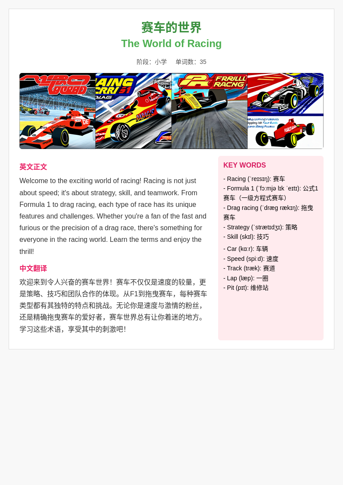

# 英卡助手 · LinguaCard

**主要功能** ：自动生成英语学习卡片（文本 + 图像），可用于小红书发布

本版本为 V1，实现了从输入主题词 → 自动内容生成 → 插图生成 → HTML 渲染 → 卡片导出 的完整流程。
一些卡片的展示
<h3>卡片展示示例</h3>

<table>
  <tr>
    <td></td>
    <td></td>
  <tr>
  <tr>
    <td></td>
    <td></td>
  </tr>
</table>

---

## 🔁 项目整体流程图

```
用户输入主题/参数
        ↓
使用 InternLM 调用生成英文短文 + 中文翻译 + 关键词
        ↓
将生成结果填充至 HTML 卡片模板
        ↓
HTML 渲染 → PNG 图片（html2image 或 headless browser）
        ↓
图片保存至本地/服务器，供后续上传小红书/公众号等使用
```

---

## 🧱 模块划分（通用三层结构）

| 模块层          | 模块名称              | 说明                               |
| --------------- | --------------------- | ---------------------------------- |
| 🧠 智能生成层   | `text_generator.py` | 使用 InternLM 接口生成英语卡片内容 |
| 🎨 卡片渲染层   | `card_renderer.py`  | 通过 HTML 模板 + Jinja2 填充内容   |
| 🖼️ 输出导出层 | `image_exporter.py` | HTML → PNG 图片，用于展示或发布   |

---

## 🚧 三阶段版本规划

### 🚀 V1：文本卡片自动生成与图片导出（基础 MVP）

 **目标** ：最小可用版本，用户可通过 CLI 输入主题 → 自动生成图片

 **功能列表** ：

* [ ] 命令行参数输入（如：主题、阶段、单词数）
* [ ] InternLM 文本生成调用封装
* [ ] Jinja2 模板填充 HTML 卡片
* [ ] HTML → PNG 卡片图片（html2image）
* [ ] 保存结果到本地 `/output` 文件夹

 **技术关键词** ：Python, requests, Jinja2, html2image, headless Chrome (推荐 Puppeteer)

 **文件结构（初步）** ：

```
lingua_card/
├── main.py                # CLI 主控制逻辑
├── config.py              # API Token 管理
├── generator.py           # InternLM 文本生成模块
├── renderer.py            # HTML 卡片模板填充
├── exporter.py            # 图片导出模块
├── templates/card.html    # 卡片 HTML 模板
├── output/                # 输出图片
└── requirements.txt
```

---

### 🌈 V2：交互式 Web 界面（Streamlit/Gradio 可选）

 **目标** ：提供可视化操作界面，用户无需写命令行

 **新增功能** ：

* [ ] 主题输入框 + 参数选择（级别、风格等）
* [ ] 在线生成卡片图并展示
* [ ] 下载图片按钮
* [ ] 多模板风格可选（卡通/极简/留白）

 **技术关键词** ：Streamlit 或 Gradio（建议 Streamlit）

 **扩展结构** ：

```
web_ui/
├── app.py                # Streamlit 页面入口
├── assets/               # 样式、图标等
└── templates/            # 多风格卡片模板
```

---

### 🧠 V3：后端服务部署 + 定时任务 + 批量生成

 **目标** ：可作为 SaaS 工具部署 + 每日生成批量卡片

 **功能扩展** ：

* [ ] 后台服务（FastAPI）接收请求生成卡片（可供小程序/前端调用）
* [ ] 每日定时生成卡片内容（如定时更新5个主题）
* [ ] 管理词库 / 用户收藏 / 生词本功能（预留数据库支持）
* [ ] 卡片生成记录追踪与日志

 **技术关键词** ：FastAPI, APScheduler, SQLite or MongoDB（可选）

---

## 📌 推荐技术栈（统一 Python 生态）

| 类型         | 推荐                       | 说明                      |
| ------------ | -------------------------- | ------------------------- |
| 模型调用     | `requests`+ InternLM API | 免费、稳定的 API 调用接口 |
| 模板渲染     | `Jinja2`                 | HTML 模板替换关键变量     |
| HTML → 图片 | `html2image`+ Chromium   | 稳定无头浏览器截图        |
| 交互界面     | `Streamlit`（V2）        | 快速上线，适合初版 UI     |
| 后端服务     | `FastAPI`（V3）          | REST API 服务搭建         |
| 定时任务     | `APScheduler`            | 定时任务调度              |

---

## ✅ 建议开发顺序

1. ✅ 实现 V1 的命令行卡片生成流程（建议我先帮你搭建基础框架）
2. ⏩ 等你测试成功后，进入 V2 可视化页面构建
3. 🛠️ 后期部署服务器版本，加入多任务 & 数据保存能力

---

## 安装stablediffusion

主要的脚本如下，参考原来的readme https://github.com/Stability-AI/stablediffusion?tab=readme-ov-file

```bash
git clone https://github.com/Stability-AI/stablediffusion.git
conda create -n stablediff -y python=3.10
conda activate stablediff
cd stablediffusion
conda install pytorch==1.12.1 torchvision==0.13.1 -c pytorch
pip install transformers==4.19.2 diffusers invisible-watermark
pip install -e .
```

原始的仓库建议使用xformers 加快推理的速度，具体的操作如下
先使用 `nvcc--vession `查看自己的cuda版本，我的是12.4版本

```bash
(stablediff) (base) hhe@ps:~/mnt/prj/xformers$ nvcc --version
nvcc: NVIDIA (R) Cuda compiler driver
Copyright (c) 2005-2024 NVIDIA Corporation
Built on Tue_Feb_27_16:19:38_PST_2024
Cuda compilation tools, release 12.4, V12.4.99
Build cuda_12.4.r12.4/compiler.33961263_0
```

文生图模型中自注意力模块占用大量显存，`xformers` 可降低 30%+ 显存占用，并提升速度，后续的安装命令：

```bash
export CUDA_HOME=/usr/local/cuda-12.4
conda install -c nvidia/label/cuda-12.4.0 cuda-nvcc
conda install -c conda-forge gcc
conda install -c conda-forge gxx_linux-64==9.5.0
cd ..
git clone https://github.com/facebookresearch/xformers.git
cd xformers
git submodule update --init --recursive
pip install -r requirements.txt
pip install -e .
cd ../stablediffusion
```

验证是否安装成功，在终端中的conda环境下面运行如下命令，或者使用 `pip show xformers`

```bash
python -c "import xformers; print(xformers.__version__)"
#输出
0.0.31+da84ce3a.d20250601
```
