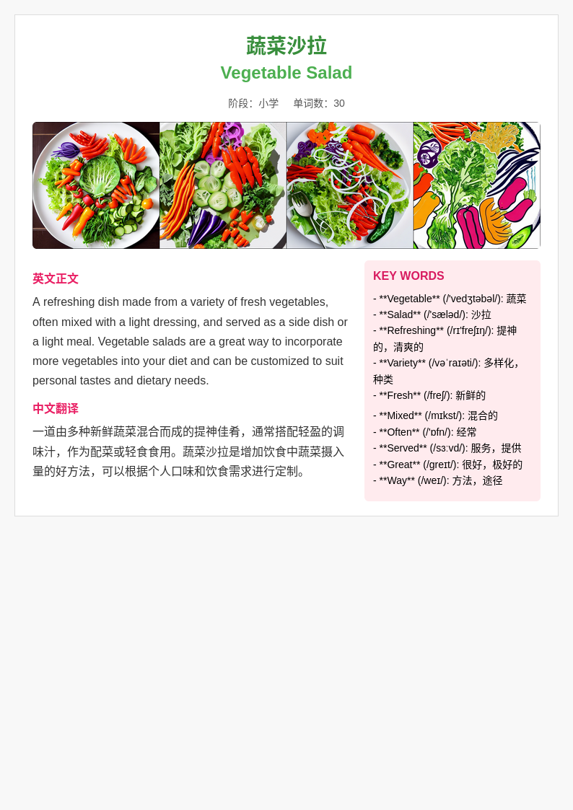

# 创建项目环境

conda create -n lingua python=3.10 -y
conda activate lingua

# 安装依赖

pip install -r requirements.txt

# 目录结构

```
lingua_card_assistant/
├── main.py                      # 主控制入口
├── config.py                    # 存储 API Token 和配置项
├── generator/
│   └── text_generator.py        # 书生模型生成模块
├── renderer/
│   └── card_renderer.py         # Jinja2 HTML 渲染
├── exporter/
│   └── html_to_image.py         # HTML 转 PNG（html2image）
├── templates/
│   └── card_template.html       # 卡片 HTML 模板
├── output/                      # 存放生成的 PNG
├── docs/                        # 项目说明、记录文档
│   └── project_plan.md          # 项目开发计划
├── requirements.txt             # Python依赖
└── README.md                    # 简要说明文档
```

# LinguaCard 项目说明文档（版本 V1）

## 📌 项目简介

**LinguaCard** 是一个基于大语言模型和文生图模型的英语学习卡片生成器，支持自动生成英文段落、重点词汇、中文翻译及配套插图，并以卡片样式导出为 HTML 和 PNG 图片。

本版本为 V1，实现了从输入主题词 → 自动内容生成 → 插图生成 → HTML 渲染 → 卡片导出 的完整流程。
一些卡片的展示

<h3>卡片展示示例</h3>

<table>
  <tr>
    <td></td>
    <td></td>
  </tr>
  <tr>
    <td></td>
    <td></td>
  </tr>
</table>

---

## 🧱 项目结构

```bash
LinguaCard/
├── main.py                       # 主入口脚本，执行卡片生成流程
├── generator/
│   ├── text_generator.py         # 调用书生大模型生成卡片正文、翻译、词汇等
│   └── llm_prompt_generator.py   # 调用书生大模型生成插图提示词 prompt
├── image_gen/
│   └── local_sd_gen.py           # 本地部署 Stable Diffusion 模型生成插图
├── renderer/
│   └── card_renderer.py          # Jinja2 渲染 HTML 卡片
├── exporter/
│   └── html_to_image_firefox.py  # 使用 Firefox 截图保存为 PNG
├── templates/
│   └── card_template.html        # HTML 模板样式（V1）
├── output/                       # 卡片生成输出目录（HTML + PNG）
├── .env                          # 环境变量（存储 API Token）
└── requirements.txt              # 项目依赖（可选）
```

---

## 🚀 功能流程

第一个版本的主要的流程如下：

```mermaid
flowchart LR
    A[输入主题词] --> B[调用书生生成卡片内容]
    B --> C[调用书生生成插图 prompt]
    C --> D[调用本地 SD 生成插图]
    D --> E[渲染 HTML 卡片]
    E --> F[Firefox 截图为 PNG]
```



---

## 📥 使用方法

### 1.创建conda环境

这里的环境包含了本地运行部署的stablediffusion所需包

```bash
conda create -n lingua python=3.10 -y
conda activate lingua
git clone https://github.com/hehao678/LinguaCard.git
cd LinguaCard
pip install -r requirements.txt
```

### 2. 创建 `.env` 文件

```env
API_TOKEN=你的书生API密钥
```

### 3.安装并部署stablediffusion

目前好多的文生图模型api需要一定的费用，如果自己输入提示词再网站上生成，输出图片然后拼接卡片也是可以的；
这里提供一种本地部署的stablediffusion的方式，后续可以通过脚本直接运行部署，通过模型输出的prompt直接生成相关的图片

首先需要下载相关的stabledifusion库

```bash
conda activate lingua
git clone https://github.com/Stability-AI/stablediffusion.git

```

具体的使用说明可以参考[stablediffusion version的说明](https://github.com/Stability-AI/stablediffusion?tab=readme-ov-file#)

可以选择直接再huggingface上面下载相关的模型文件，我是直接下载768-v-ema.ckpt（需要科学上网），[huggingface下载连接](https://huggingface.co/stabilityai/stable-diffusion-2/blob/main/768-v-ema.ckpt)；

环境安装之前在requirements.txt已经封装好了，需要安装xformers加快模型的推理速度

需要将下载之后的模型文件放入到stablediffusion/checkpoints文件夹里面

原始的stablediffusion仓库

### 2. 运行示例

```bash
python main.py "雪山" "小学" 60
```

输出结果：

- `output/雪山.html` → HTML 卡片
- `output/雪山.png` → 卡片截图图像

---

## 📸 示例截图

- HTML 卡片示例：`output/雪山.html`
- 插图由本地 SD 模型生成，风格统一（如卡通、油画风）

---

## ⚙️ 配置说明

- `image_gen/local_sd_gen.py` 默认使用 `768-v-ema.ckpt` 权重
- 本地显卡需支持 ≥12G 显存，建议安装 xformers 加速模块
- 模板风格 `card_template.html` 可切换或定制

---

## 🗂 分支规划建议

| 分支名称 | 用途                                     |
| -------- | ---------------------------------------- |
| `main` | 主线稳定版本                             |
| `v1`   | 当前第一个完整卡片生成版本               |
| `v2`   | 下一阶段：美化模板 / 限制词数 / 卡片分页 |

---

## 🧠 后续优化方向（v2规划）

- 限制每类单词数量，避免信息过载
- 插图与模板风格统一（LoRA / Filter）
- 卡片内容分页、动态展示、批量生成
- 封装为 Web App 或分享图文风格（小红书）

---

## 📌 作者备注

该项目为个人 Agent 工程实战，用于演示如何结合大语言模型 + 本地推理模型完成知识型内容生成工作流。

欢迎参考和扩展。
